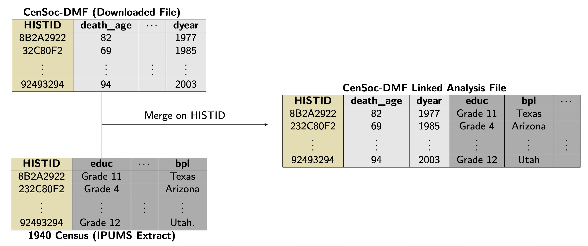

## CenSoc Roadmap 

The CenSoc datasets link the complete-count 1940 U.S. Census to Social Security mortality records. The unprecedented size and richness of CenSoc allows investigators to make new discoveries into geographic, racial, and class-based disparities in mortality in the United States. In order to work with a full CenSoc dataset, researchers will need to:  

1. Download CenSoc File [[Link](https://censoc.berkeley.edu/data/)]
2. Download 1940 Census data from IPUMS-USA [[Link](https://usa.ipums.org/usa/)]
3. Merge CenSoc and 1940 Census files on `HISTID` variable

The figure below gives an overview of how researchers merge together the CenSoc file and the 1940 Census file on the unique identifier variable  `HISTID` to create their final dataset for analysis.

```{r echo = F, fig.align = 'center', out.width = "100%", fig.cap = "**Figure 1:** Illustration of merging the CenSoc-DMF to an IPUMS 1940 Census data extract."}

```


**Note**: The 1940 Census file is large (10+ GB) — we recommend having an appropriate workflow for handling large datasets in R before getting started.  


## Downloading CenSoc File

Download the CenSoc-DMF or CenSoc-Numident file from: [https://censoc.berkeley.edu/data/](https://censoc.berkeley.edu/data/)

Whether the CenSoc-DMF or CenSoc-Numident file is a better choice for your analysis will depend on the research question. See the [data](https://censoc.org/data/) page for more information. 

## Downloading 1940 Full-Count Census from IPUMS

The CenSoc datasets link the 1940 Census to the mortality records.

[IPUMS](https://ipums.org/what-is-ipums) provides integrated census and survey data from across the world free of charge to the broader research community. To access the IPUMS-USA data collection, you first need to [register](https://uma.pop.umn.edu/usa/user/new?return_url=https%3A%2F%2Fusa.ipums.org%2Fusa-action%2Fmenu). 

### Create IPUMS extract

Once you have an account, proceed to https://usa.ipums.org/usa/ and, under 'CREATE YOUR CUSTOM DATA SET', select 'GET DATA'.

#### Select data sample

 Select the 1940 Full Count Census:

- Click the 'SELECT SAMPLES' button. This will take you to a page with all available census and ACS data.
- Uncheck 'Default sample from each year'
- Select the 'USA FULL COUNT' tab
- Check '1940 100%'
- Click 'SUBMIT SAMPLE SELECTIONS'

This return you to the variable selection page.

#### Select Variables for Analysis

All extracts will by default include `HISTID`, the variable used to the link the census file to the CenSoc file.

Choose variables for your analysis. For example, to include `RACE`, slide over the 'PERSON' tab and select 'RACE, ETHNICITY, AND NATIVITY'.

#### Select Cases  

The IPUMS "select cases" feature allows users to conditionally choose which states to include in an extract. This can be helpful if you are only interested in a subset of the Census. For example, if you are working with the CenSoc-DMF file, which includes only men, it makes sense to restrict your cases to men-only. 

### Downloading the IPUMS extract

To work with IPUMS data in R, it is usually easiest to download the data as a CSV file. To do this, on the EXTRACT REQUEST page, next to 'DATA FORMAT', click Change, select 'Comma delimited (.csv)' and submit.

You can work with other formats in R as well, but CSV is generally the easiest. The only downside is that variable values are numeric codes. The [IPUMSR package](https://cran.r-project.org/web/packages/ipumsr/vignettes/ipums.html) helps assign variable labels, value labels, and more.
 
Once you are satisfied with your dataset, click the 'SUBMIT EXTRACT' button. Because it is full count data, you will need to agree to special usage terms. Click OK to extract the dataset.

Given the size of the file, the processing may take several hours. Once the file is ready, you will receive an email from IPUMS with a link to download the resulting dataset. The IPUMS datasets will be compressed in a .zip file, so you will have to open that after the download. For more information on IPUMS extracts, please see [IPUMS-USA](https://usa.ipums.org/usa/data.shtml).

## Merging CenSoc and Census

After downloading the 1940 Census and CenSoc files, the files must be merged before analysis. The `HISTID` variable — available in both CenSoc and Census files — can be used to merge the two datasets. 

Sample R code: 

```{r, eval = F}
library(tidyverse)

## read in censoc file
censoc <- read_csv('path/to/censoc/file.csv')

## read in census file
census <- read_csv('path/to/census/file.csv') 

## Join the census files by HISTID
merged_analysis_file <- censoc %>%
  inner_join(census, by = "HISTID")
```
