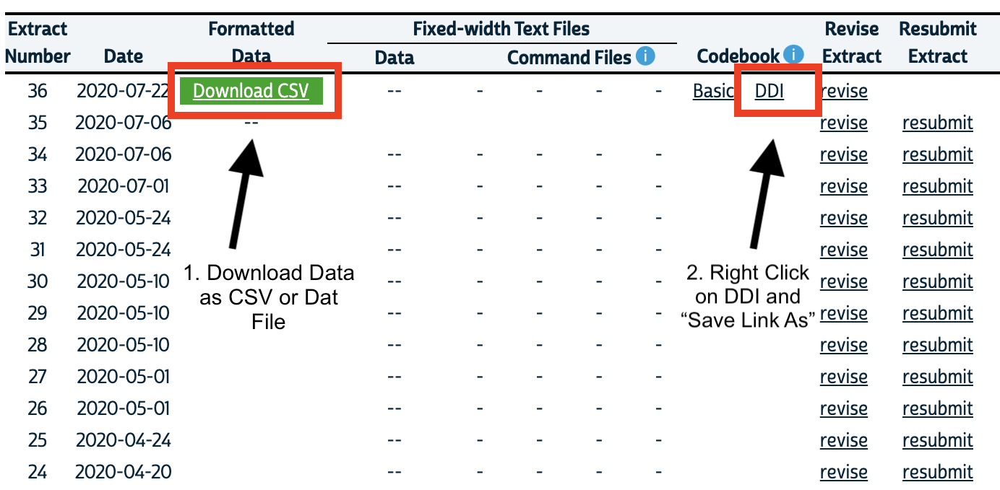

**Summary**: This vignette presents a workflow for analyzing CenSoc data using the `ipumsr` package, an easy way to import IPUMS data and its associated metadata into R. The goal of this vignette is to provide motivation as to why CenSoc users may want to use the `ipumsr` package and provide a basic outline of its functionality. 

Before getting started with the vignette, you'll need to: 

1. Install the following packages if necessary (use the `install.packages()` function)

    - `tidyverse`
    - `ipumsr`

2. [Download](https://dataverse.harvard.edu/dataverse/censoc/) the CenSoc-Numident or CenSoc-DMF file 

3. [Download](https://usa.ipums.org/usa/) the 1940 full count census and accompanying DDI from IPUMS (instructions below)


The original R notebook (.Rmd file) for this vignette can be downloaded [here](https://github.com/caseybreen/censocdev/tree/master/codebase/06_website_vignettes).

## IPUMS and the `ipumsr` package


[IPUMS](https://ipums.org/what-is-ipums) provides integrated census and survey data from across the world free of charge to the broader research community. IPUMS is a terrific resource for the social science community—they clean and harmonize data and offer an interactive extract system that allows users to select only the samples and variables relevant for their research question.  To access the IPUMS-USA data collection, you first need to [register](https://uma.pop.umn.edu/usa/user/new?return_url=https%3A%2F%2Fusa.ipums.org%2Fusa-action%2Fmenu). 

The `ipumsr` package, created by Greg Freedman Ellis at the Institute for Social Research and Data Innovation, reads in IPUMS data and its associated metadata, such as variable descriptions and value labels, into R. It also has some helpful functions for working with big IPUMS datasets. In the context of CenSoc, it's particularly helpful for assigning meaningful text labels to numeric codes (e.g., for the `SEX` variable, 1 = "Male", 2 = "Female"). 

For a more thorough coverage of the `ipumsr` package, please visit the [ipumsr website](http://tech.popdata.org/ipumsr/articles/ipums.html). 

### Downloading 1940 Full-Count Census from IPUMS

Once you have an account, visit https://usa.ipums.org/usa/ and select 'GET DATA', listed under 'CREATE YOUR CUSTOM DATA SET.' 

#### Select data sample

 Select the 1940 Full Count Census:

- Click the 'SELECT SAMPLES' button. This will take you to a page with all possible census and ACS data available.
- Uncheck the 'Default sample from each year' box
- Click the 'USA FULL COUNT' tab
- Check the 1940 100% box
- Click 'SUBMIT SAMPLE SELECTIONS' button

This will take you back to the variable selection page.

#### Select Variables for Analysis

All extracts will, by default, include `HISTID`, the variable used to link the census file to the CenSoc file.

Choose variables for your analysis. For example, you could select `RACE`, which is under PERSONAL & RACE, ETHNICITY, AND NATIVITY.

#### Select Cases

The IPUMS "select cases" feature allows users to conditionally choose which records to include in an extract. If you are only interested in a subset of the Census, this is a great way to reduce the size of your extract! For example, if you are working with the CenSoc-DMF file, which includes only men, it would make sense to restrict your cases to men-only. 

#### Downloading the data and DDI

To do this, visit the 'EXTRACT REQUEST' page and click 'Change,' which is located next to 'DATA FORMAT.' Then,  select 'Comma delimited (.csv)' or 'Fixed-width text (.dat) and click the submit button. Once you are happy with your dataset, click the 'SUBMIT EXTRACT' button. Agree to the full-count usage terms, and click 'OK' to extract the dataset.

Given the size of the extract, it may take a few hours before it's available for download. Once the file is ready, you will receive an email from IPUMS with a link to download the resulting dataset. For more information on IPUMS extracts, please see [IPUMS-USA](https://usa.ipums.org/usa/).

To read in IPUMS data with the `ipumsr` package, you'll need to download:

- Data file as .CSV or .DAT
- DDI codebook file 

{width=100%}

## IPUMSR Workflow

### Merging CenSoc and Census Data

To work with the full CenSoc files, you'll first need to (i) read in the 1940 census, (ii) read in the CenSoc File, and (iii) merge them on the HISTID variable. Note that we also have pre-linked CenSoc "demo" files — please see this [vignette](https://cran.r-project.org/web/packages/ipumsr/vignettes/ipums.html) for more information.

One challenge of working with the full CenSoc files is that you must work with large files. For example: 

- Full Count 1940 Census File (30 variables): 132 million records, 18 GB
- CenSoc Numident: 6.8 million records, 760 MB

If both datasets fit into your computer or server's memory, merging the datasets on the `HISTID` variable is straightforward. 

```{r, eval = F}
## Library Packages
library(tidyverse) ## functions for data manipulation and visualization
library(ipumsr) ## reads in IPUMS data and associated metadata

## read in censoc file
censoc <- read_csv("~/path/to/censoc/censoc_numident_v2.1.csv")

## read in census file with ipumsr package
census <- read_ipums_micro(data_file = '~/path/to/ipums/usa_00036.csv.gz',
                           ddi = '~/path/to/ipums/usa_00036.xml')

## join the census files by HISTID
censoc_numident_linked <- inner_join(censoc, census, by = "HISTID")
```

### "Chunked" strategy for overcoming memory limitations 

A memory-conscious solution is to break the census dataset up and work in chunks. The `ipumsr` package has the `read_ipums_micro_chunked()` functions to read in a set number of observations at a time (chunks). The code below uses that function to (i) read in a chunk of the 1940 census (ii) merge that chunk to the CenSoc file on the `HISTID` variable and (iii) repeat for every chunk and then combine all the merged chunks. Then you'll be ready to get started on your analysis. 

Depending on how many variables you've included in your 1940 census extract, the approach may take a while. For reference, the below code took approximately 50 minutes on a 2018 base Macbook Pro with 16 GB of memory. The good news is that you only need to do this once — see the instructions below on how to save your merged data file.  

```{r, eval = F}
## set paths to censoc file 
censoc <- read_csv("~/path/to/censoc/censoc_numident_v2.1.csv")

## Set paths to IPUMS data file — .csv or .dat file! 
ipums_data <- '~/path/to/census/usa_00033.csv'

## set path to IPUMS DDI file 
ipums_ddi <- '~/path/to/census/ddi/usa_00033.xml'

## Read in data in chunks and merge with censoc
censoc_numident_linked <- read_ipums_micro_chunked(ddi = ipums_ddi,
                                           data_file = ipums_data, 
  callback = IpumsDataFrameCallback$new(function(x, pos) {
    inner_join(x, censoc, by = "HISTID")
  }), 
  chunk_size = 500000,
)

censoc_numident_linked <- read_ipums_micro_chunked(ddi = ipums_ddi,
                                           data_file = ipums1pct, 
  callback = IpumsDataFrameCallback$new(function(x, pos) {
    inner_join(x, censoc, by = "HISTID")
  }), 
  chunk_size = 500000,
)
## This is slow -- it takes ~an hour. 

#> Use of data from IPUMS USA is subject to conditions including that users should
#> cite the data appropriately. Use command `ipums_conditions()` for more details.

#> |========================================================   | 90% 16963 MB
```

There are a few other strategies for handling datasets too large for memory in R: 

- *Three Strategies for Working with Big Data in R.*  ([link](https://rviews.rstudio.com/2019/07/17/3-big-data-strategies-for-r/))
- *Big IPUMS Data* vignette ([link](https://cran.r-project.org/web/packages/ipumsr/vignettes/ipums-bigdata.html))
- *Introduction to Disk.Frame package* ([link](https://diskframe.com/index.html))

### Assign metadata to already-linked CenSoc data

If you import and link your CenSoc file to the 1940 Census using a different approach, you can still use the IPUMSR package to assign meaningful value labels to the linked file — just use the `ipums_collect()` function. 

```{r, eval = F} 
## read in IPUMS DDI for IPUMS extract
ddi_extract <- read_ipums_ddi("/path/to/ddi/usa_00033.xml")

## assign metadata using the ipumsr package
censoc_numident_linked <- ipums_collect(data = censoc_numident_linked,  
                       ddi = ddi_extract, 
                       var_attrs = c("val_labels", "var_label", "var_desc"))
```

## `ipumsr` package functionality

There are [several helpful functions](https://cran.r-project.org/web/packages/ipumsr/ipumsr.pdf) in the `ipumsr` package to work with the metadata. In this vignette, we'll only cover a few. 

### Explore variable descriptions 

The `ipums_view()` function will display a webpage with variable descriptions and value labels in the RStudio viewer. This is an easy way to learn more about the 1940 census variables. 

```{r, eval = F}
ipums_view(censoc_numident_linked)
```

{width=100%}

### Set Value Labels

The `ipumsr` package imports the associated metadata, such as variable labels, value labels, and more from the IPUMS extract. Particularly helpful are value labels, which translate the numeric IPUMS code into meaningful text strings (e.g., the `SEX` variable has value labels: 1 = "Male", 2 = "Female.") 

The `ipumsr` package stores labelled values using the `labelled` class from the `haven` package. The main way to create a factor variable from these labels is the `as_factor()` function (**note**: the base R `as.factor()` function will not work). 

For example, if you're interested in birthplace, you can convert the numeric `BPL` into a meaningful text string variable using the `as_factor()` function: 

```{r, eval = F}
## Look at value labels for birthplace 
ipums_val_labels(censoc_numident_linked$BPL)

## A tibble: 163 x 2
#     val lbl                 
#   <dbl> <chr>               
# 1     1 Alabama             
# 2     2 Alaska              
# 3     4 Arizona             
# 4     5 Arkansas            
# 5     6 California          
# 6     8 Colorado   

## create a new string variable for birthplace 
censoc_numident_linked$BPL_string = as_factor(censoc_numident_linked$BPL)

## alternative method to create new string variable for birth place (style of tidyverse)
censoc_numident_linked <- censoc_numident_linked %>% 
  mutate(BPL_string = as_factor(BPL))

## look at a few rows
censoc_numident_linked %>%
  select(HISTID, BPL, BPL_string) %>% ## print out a few rows
  sample_n(5) 
```

|HISTID                               | BPL|BPL_string |
|:------------------------------------|---:|:----------|
|A25606D5-4E07-460D-9DF4-F23C89440249 |   6|California |
|DB43E7FC-9077-4A20-890A-65CB8F7E51C9 |  17|Illinois   |
|DD0ED6E5-2058-4FBC-A830-D38FC6425DA5 |  17|Illinois   |
|5AB5B1E4-D332-49DB-A8C9-1F6E4F459771 |  39|Ohio       |
|FEA7EC29-BDF7-41FD-9955-5442D56D8DC2 |  26|Michigan   |

We now can use the easily interpretable `BPL_string` variable for our analysis.  

In some cases, it may be useful to keep the original numeric codes. For example, if you want to restrict to persons born in North America, it's easier to do so with the original BPL codes, as the codes are ordered in a meaningful way—you just restrict to BPL codes below 200. It's more difficult, however, if you have to specify each individual state and country in North America. 

### Saving your data and metadata

To save your data file and it's associated metadata, you need to write it out as an object. The metadata cannot be stored in a .CSV file, so if you want to save the metadata, you'll need to save the entire object to a file using the `saveRDS` function. 

```{r, eval = F}
## save censoc data file with metadata
saveRDS(object = censoc_numident_linked, file = "/path/to/data/censoc_numident_linked.rds")

## read in censoc data file with metadata
censoc_numident_linked <- readRDS("/path/to/data/censoc_numident_linked.rds")
```

**Note:** Another option is to convert all the relevant variables from numeric to meaningful factor variables at the beginning of your analysis, and then write out the .CSV file. You'll lose the metadata, but you can always reassign it with the `ipums_collect()` function. 

## Conclusion

The `ipumsr` packages offers a convenient workflow for analyzing large CenSoc datasets. While there are many ways to work with CenSoc data in `R`, the `ipumsr` package is the most efficient way to handle IPUMS value labels, variable descriptions, and more. 

The `ipumsr` package is currently maintained by Derek Burk and has a [user-support forum](https://forum.ipums.org/c/ipumsr/18). 


