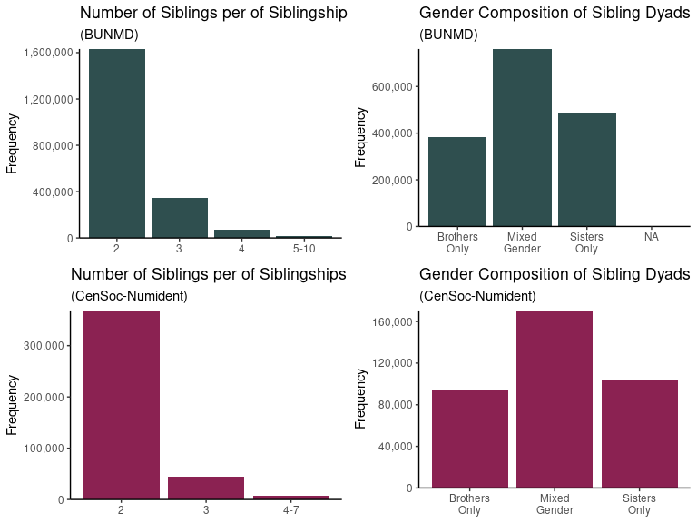

Sibling Identification in CenSoc Data
================

## Summary

Social scientists use sibling comparison studies to help control for
shared family confounders that are difficult to observe. However,
sibling relationships are not identified in administrative mortality
data. In this vignette, we describe a method for finding siblings in
Social Security Numident data, and introduce sibling ID datasets that
may be used with the Berkeley Unified Numident Mortality Database
(BUNMD) and CenSoc-Numident data.

Since the inception of Social Security in 1935, applicants have been
asked to provide the full names of their parents. This information has
been preserved in National Archives Numerical Identification (Numident)
Files, which are used to create the BUNMD. We identify siblings in the
BUNMD by finding individuals whose parents have identical first and last
names. This also allows us to identity siblings in the CenSoc-Numident,
a dataset which links the BUNMD to the 1940 Census.

## Methodology

Siblings are located by finding exact matches on four variables:
father’s first name, father’s last name, mother’s first name, and
mother’s last (maiden) name. Other variables are then used to remove
less plausible matches. A simplified overview of the process is as
follows:

1.  Clean parental name data and remove individuals with insufficient
    name data. This process involves splitting first names from middle
    names in the original Social Security data, removing non-alphabetic
    characters from names, and replacing nicknames with standardized
    first names (e.g., Lizzie to Elizabeth). Records where one or more
    parent name variables is missing, consists of only a single
    character, or a special string such as “not stated” or “UNK”, are
    removed from the data and not matched.

2.  Match siblings by identifying records where all cleaned parent
    first/last names are exactly equivalent.

3.  Refine matches by eliminating suspiciously large groups or sibling
    age gaps. Specifically, remove groups of more than 10 siblings, or
    groups of over 6 sibling where birthplace data or a parent’s middle
    name is inconsistent among siblings. Also remove siblings whose
    birth year falls more than 10 years before/after the sibling next
    nearest in age.

Siblingships were validated using parent’s middle names and other
non-matching variables. Though there is no way to completely eliminate
false positive matches, siblingships are highly consistent among
expected dimensions such as race and birthplace.

## The Data

In the BUNMD, we identify 4,697,867 individuals belonging to 2,071,468
sibling groups. In the CenSoc-Numident, 899,294 individuals belong to
420,182 sibling groups. These siblingships consist of groups of two or
more persons who died at ages 65-100 in the years 1988-2005. The maximum
group size in the BUNMD is 10 siblings; and the maximum groups size in
the CenSoc-Numident is 7 siblings. Siblingships may be of any gender
composition.

<!-- --> <br><br><br><br>

The birth year coverage of persons identified as belonging to a sibling
groups peaks around 1915-1925.

<!-- -->

## Twins

Twins may be of particular interest to researchers. It is possible to
study twins using CenSoc data, but there is no way to distinguish
identical twins from like-sex fraternal twins. Twins (and triplets) may
be identified using bithdate information.

In the BUNMD, there are 55,651 individuals belonging to twin/triplet
sets with the exact same year/month/day of birth. Twins make up the vast
majority of multiple births, though it is possible that additional
siblings from the same birth simply were not identified. 58,735
individuals belong to twin/triplet sets if only matching on exact year
and month of birth. Siblings with same year/month of birth but
discordant day of birth may be actual twins with misrecorded days of
birth, twins born one calendar day apart, or unrelated individuals
falsely identified as siblings.

Since birth day is not available in the public CenSoc-Numident file,
researchers may use year and month of birth to identify likely twins.
There are 8,382 individuals who are a twin/triplet by this definition.

We note that some twins/triplets in the BUNMD are very likely the same
individual listed under multiple Social Security numbers; such false
twins have not been removed in this preliminary release of the data.
There are over 8000 individuals in the BUNMD that have identical
year/month/day of *both* birth and death as a “sibling”, very likely
indicating a duplicate person rather a true twin. Because the
CenSoc-Numident is a linked dataset, however, such false twins are
likely less prevalent. This is because duplicate individuals usually
have identical first names, last names, birth dates, and birthplaces
listed in Social Security data. Any Social Security records with
indistinguishable name/age/birthplace information are impossible to
match to a single Census record and thus are not included in the linked
dataset.

## Usage

Sibling identifier datasets consist of two columns: a unique identifier
(either `ssn` or `HISTID`) that can be used to merge the data with the
full BUNMD or CenSoc-Numident, and an identifier for each sibling group.
The BUNMD sibling identification set appears as follows:

``` r
head(bunmd_sibs)
```

    ##        ssn bunmd_sibling_group_id
    ##      <int>                  <int>
    ## 1: 1010047                1010047
    ## 2: 1010122                1010047
    ## 3: 1010178                1010178
    ## 4: 1010185                1010178
    ## 5: 1010333                1010333
    ## 6: 1010901                1010333

For example, the first two individuals listed are siblings, with the
shared siblingship identifier number 1010047. In fact, the siblingship
identifier is just the ssn of the oldest sibling in the group.

``` r
head(numident_sibs)
```

    ##                                  HISTID            numident_sibling_group_id
    ##                                  <char>                               <char>
    ## 1: 00003324-7698-41EE-BC64-E8999308F60A 00003324-7698-41EE-BC64-E8999308F60A
    ## 2: 695D0219-A44E-4BBA-992E-09894ECA82DC 00003324-7698-41EE-BC64-E8999308F60A
    ## 3: 00008FAE-AAD6-4C29-967E-B12043290E9E 00008FAE-AAD6-4C29-967E-B12043290E9E
    ## 4: 82723198-25C8-42FD-92AE-CFF71B247890 00008FAE-AAD6-4C29-967E-B12043290E9E
    ## 5: 00009EA8-B164-4C68-B89B-2B2584622398 00009EA8-B164-4C68-B89B-2B2584622398
    ## 6: A99E1925-A820-4E9C-A7EF-0DA2166E7CD9 00009EA8-B164-4C68-B89B-2B2584622398

Similarly, each sibling group in the CenSoc-Numident will be identified
using the HISTID of the oldest sibling. Although the
`numident_sibling_group_id` column contains information from individual
HISTID’s, it can simply be thought of as a family number identifier.

It is straightforward to use the sibling identifier datasets. Users can
download the full BUNMD or CenSoc-Numident and join the sibling
identifiers using either `ssn` or `HISTID` as appropriate. For example:

``` r
# Read BUNMD 
bunmd <- fread("bunmd_v2.csv")
# Read BUNMD siblings
bunmd_sib_id <- fread("bunmd_sibs_v0.csv")
# Attach BUNMD variables to siblings
bunmd_sibs <- inner_join(bunmd, bunmd_sib_id, by = "ssn")
```

``` r
# Read CenSoc-Numident data
censoc_numident <- fread("censoc_numident_v3.csv")
# Read Numident siblings
numident_sib_id <- fread("numident_sibs_v0.csv")
# Read IPUMS 1940 census extract
census <- fread("usa_00050.csv")
# Create set of siblings with attached census variables
numident_sibs_only <- inner_join(censoc_numident, numident_sib_id, by = "HISTID")
numident_sibs_with_census <- left_join(numident_sibs_only, census, by = "HISTID")
```

## Considerations for Researchers

This method for linking siblings is fairly conservative. We validate the
links using a number of variables, and therefore believe the data to be
of high quality and consist largely of true siblings. However, we
ultimately cannot verify the truth of sibling links. Also, some siblings
identified may actually be adopted siblings, half siblings, or otherwise
not “full” biological siblings. This conservative approach, as well as
limiting siblings to those that die within a particular age and time
window, precludes the linkage of many real siblings and likely results
in smaller sibling groups than actually exist.

While researchers may use birth year/month/day information to identify
twins in the data, there is no way to distinguish identical twins from
fraternal twins of the same sex. Additionally, some apparent “twins” are
most likely the same individual listed under multiple Social Security
numbers. While the assignment of multiple Social Security numbers
(either legitimately, fraudulently, or accidentally) is quite uncommon
at present, it is possible that this happened more frequently in the
past when individuals re-applied for Social Security. A future release
will likely attempt to remove obvious false twins. Researchers may
attempt to correct this themselves by removing records with duplicated
name and/or death date information. Duplicate individuals are relatively
rare in the BUNMD overall, but may make up a significant portion of
“twins” in that dataset. This issue is fairly negligible in the
CenSoc-Numident.

We note that another method of identifying siblings in CenSoc data is to
use the census. Researchers can find siblings living in the same
household in 1940, for example, by using information on family/household
structure. A potential disadvantage of this approach is that most
identifiable siblings will be children. To find adult siblings who live
apart in 1940, it may be further necessary to link back to an earlier
census when they cohabitated as children, which can significantly reduce
sample size. This strategy may be necessary when using CenSoc-DMF data,
as these mortality data has no parent names with which to find siblings.
Census linkages are available from the Census Linking Project (men only)
or The IPUMS Multigenerational Longitudinal Panel project.
