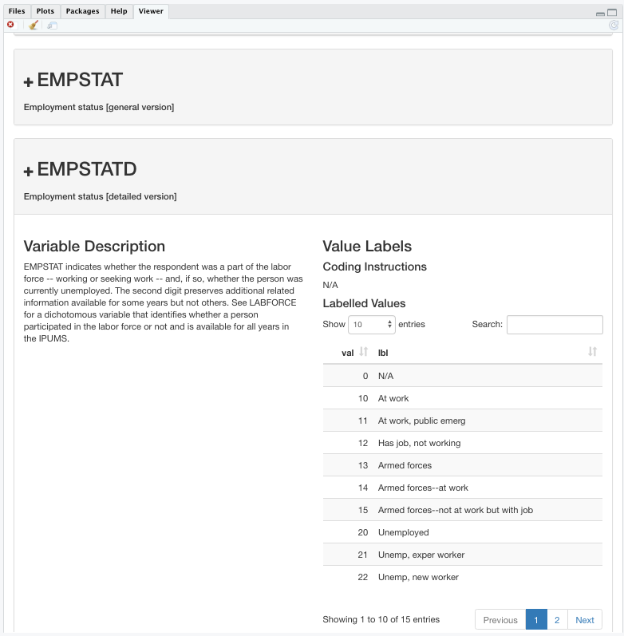

**Summary**: This vignette presents a workflow for analyzing CenSoc data using the `ipumsr` package, an easy way to import IPUMS data and its associated metadata into `R`. The goal of this vignette is to provide motivation as to why CenSoc users may want to use the `ipumsr` package and provide a basic outline of its functionality. 

Before getting started with the vignette, you'll need to: 

1. Install the following packages if necessary (use the `install.packages()` function)

    - `tidyverse`
    - `ipumsr`
    - `brooms`
    
2. [Download](https://censoc-download.demog.berkeley.edu/) the CenSoc-Numident or CenSoc-DMF file 

3. [Download](https://usa.ipums.org/usa/) the 1940 full count census and accompanying DDI from IPUMS (instructions below)


The original R notebook (.Rmd file) for this vignette can be downloaded [here](https://github.com/caseybreen/censocdev/tree/master/vignettes/website).

## IPUMS and the `ipumsr` package


[IPUMS](https://ipums.org/what-is-ipums) provides integrated census and survey data from across the world free of charge to the broader research community. IPUMS is a terrific resource to the social science community—they clean and harmonize data, and offer an interactive extract system that allows users to select only the samples and variables relevant for their research question.  To access the IPUMS-USA data collection, you first need to [register](https://uma.pop.umn.edu/usa/user/new?return_url=https%3A%2F%2Fusa.ipums.org%2Fusa-action%2Fmenu). 

The `ipumsr` package, created by Greg Ellis at the Institute for Social Research and Data Innovation, reads in IPUMS data and its associated metadata, such as variable descriptions and value labels. It also has some helpful functions for working with big IPUMS datasets. In the context of CenSoc, it's particularly helpful for assigning meaningful text labels to numeric codes (e.g., for the `SEX` variable, 1 = "Male", 2 = "Female"). 

For a more thorough coverage of the `ipumsr` package, please visit the [ipumsr website](http://tech.popdata.org/ipumsr/articles/ipums.html). 

### Downloading 1940 Full-Count Census from IPUMS

Once you have an account, visit https://usa.ipums.org/usa/ and select 'GET DATA', listed under 'CREATE YOUR CUSTOM DATA SET'. 

#### Select data sample

 Select the 1940 Full Count Census:

- Click the 'SELECT SAMPLES' button. This will take you to a page with all possible census and ACS data available.
- Uncheck the 'Default sample from each year' box
- Click the 'USA FULL COUNT' tab
- Check the 1940 100% box
- Click 'SUBMIT SAMPLE SELECTIONS' button

This will take you back to the variable selection page.

#### Select Variables for Analysis

All extracts will, by default, include `HISTID`, the variable used to the link the census file to the CenSoc file.

Choose variables for your analysis. For example, you could select `RACE`, which is under PERSONAL &rarr; RACE, ETHNICITY, AND NATIVITY.

#### Select Cases

The IPUMS "select cases" feature allows users to conditionally choose which records to include in an extract. This can be helpful if you are only interested in a subset of the Census. For example, if you are working with the CenSoc-DMF file, which includes only men, it makes sense to restrict your cases to men-only. 

#### Downloading the data and DDI

To do this, visit the 'EXTRACT REQUEST' page, and click 'Change', which is located next to 'DATA FORMAT'. Then,  select 'Comma delimited (.csv)' or 'Fixed-width text (.dat) and click the submit button. Once you are happy with your dataset, click the 'SUBMIT EXTRACT' button. Agree to to full-count usage terms, and click 'OK' to extract the dataset.

Given the size of the extract, it may take a few hours before it's available for download. Once the file is ready, you will receive an email from IPUMS with a link to download the resulting dataset. For more information on IPUMS extracts, please see [IPUMS-USA](https://usa.ipums.org/usa/data.shtml/).


To read in IPUMS data with the `ipumsr` package, you'll need to download:

- Data file as .CSV or .DAT
- DDI codebook file 

{width=100%}

## IPUMSR Workflow

```{r Library packages, warning=FALSE, message=FALSE, eval = F}
## Library Packages
library(tidyverse) ## set of packages to facillitate data analysis 
library(ipumsr) ## reads in ipums data and associated metadata
```

### Merging CenSoc and Census

To work with the full CenSoc-Numident file, you'll need to (i) read in the 1940 census, (ii) read in the CenSoc File, and (iii) match them on the HISTID variable. 

If both datasets can fit into your computer's memory, merging the datasets on the `HISTID` variable is fairly straightforward:

```{r, eval = F}
## read in censoc file
censoc <- read_csv("~/Documents/data/censoc_numident_v1/censoc_numident_v1.csv")


## read in census file with IPUMSR
census <- read_ipums_micro(data = '~/Documents/data/ipums/usa_00036.csv.gz',
                           ddi = '~/Documents/data/ipums/usa_00036.xml')

## join the census files by HISTID
censoc_numident_linked <- inner_join(censoc, census, by = "HISTID")
```

### "Chunked" strategy for overcoming memory limitations 

One challenge of working with a full CenSoc file is that you must work with the large 1940 full count census file, which has over 130 million records and can be ~20+ GB in size. This often means that it's too large to fit into a computer's memory.

A memory-conscious solution is to break the dataset up and work in "chunks." The `ipumsr` package has the `read_ipums_micro_chunked()` functions to help out with this. The code below uses that function to (i) read in a chunk of the 1940 census (ii) merge that chunk to the CenSoc file on the `HISTID` variable and (iii) repeat for every chunk and then combine all the merged chunks. Then you'll be ready to get started on your analysis. 

```{r, eval = F}
## set paths to censoc file 
censoc <- read_csv("~/Documents/data/censoc_numident_v1/censoc_numident_v1.csv")

## Set paths to IPUMS data file — .csv or .dat file! 
ipums_data <- '~/Documents/data/ipums/usa_00036.csv.gz'

## set path to IPUMS DDI file 
ipums_ddi <- '~/Documents/data/ipums/usa_00036.xml'

## Read in data in chunks and merge with censoc
censoc_numident_linked <- read_ipums_micro_chunked(ddi = ipums_ddi,
                                           data_file = ipums_data, 
  callback = IpumsDataFrameCallback$new(function(x, pos) {
    suppressWarnings(inner_join(x, censoc, by = "HISTID"))
  }), 
  chunk_size = 1000000,
)
## This is slow -- it might take up to 45+ minutes.

#> Use of data from IPUMS USA is subject to conditions including that users should
#> cite the data appropriately. Use command `ipums_conditions()` for more details.

#> |========================================================   | 90% 16963 MB
```

### Assign metadata 

If you have already read-in and linked your CenSoc file using another approach, you can still use  `ipumsr` and a DDI to assign meaningful value labels to the linked file — just use the `ipums_collect()` function. 

```{r, eval = F}
## read in IPUMS DDI for IPUMS extract
ddi_extract <- read_ipums_ddi("/data/josh/CenSoc/censoc_data/ipums_1940_extract/fullcount.ddi.xml")

## assign metadata using ipumsr package
censoc_numident_linked <- ipums_collect(data = censoc_numident_linked,  
                       ddi = ddi_extract, 
                       var_attrs = c("val_labels", "var_label", "var_desc"))
```
## `ipumsr` package functionality

There are several helpful functions in the `ipumsr` package to work with the metadata. In this vignette, we'll only cover a few. 

### Explore variable descriptions 

For starters, the `ipums_view()` function will display a webpage with variable descriptions and value labels in the RStudio viewer. This is an easy way to learn more about the 1940 census variables. 

```{r, eval = F}
ipums_view(censoc_numident_linked)
```
{width=100%}


### Set Value Labels

The `ipumsr` package imports the associated metadata, such as variable labels, value labels, and more from the IPUMS extract. Particularly helpful are variables labels; they translate the numeric IPUMS code into meaningful text strings (e.g., the `SEX` variable has value labels: 1 = "Male", 2 = "Female.") 


For example, if you're interested in birthplace, you can convert the numeric `BPL` into a new factor variable with text labels using the `as_factor` function: 

```{r, eval = F}
## Look at value labels for pirthplace 
ipums_val_labels(censoc_numident_linked$BPL)

## A tibble: 163 x 2
#     val lbl                 
#   <dbl> <chr>               
# 1     1 Alabama             
# 2     2 Alaska              
# 3     4 Arizona             
# 4     5 Arkansas            
# 5     6 California          
# 6     8 Colorado   

## create a new string variable for birthplace
censoc_numident_linked %>% 
  mutate(BPL_string = as_factor(BPL)) %>% ## create new string variable for birth place
  select(HISTID, BPL, BPL_string) %>% ## print out a few rows
  sample_n(5) 
```

|HISTID                               | BPL|BPL_string |
|:------------------------------------|---:|:----------|
|A25606D5-4E07-460D-9DF4-F23C89440249 |   6|California |
|DB43E7FC-9077-4A20-890A-65CB8F7E51C9 |  17|Illinois   |
|DD0ED6E5-2058-4FBC-A830-D38FC6425DA5 |  17|Illinois   |
|5AB5B1E4-D332-49DB-A8C9-1F6E4F459771 |  39|Ohio       |
|FEA7EC29-BDF7-41FD-9955-5442D56D8DC2 |  26|Michigan   |

Note that in some cases, it may be useful to keep the original numeric codes. For example, if you want to restrict to persons born in North America, it's easier to do so with the original BPL codes, as the codes are ordered in a meaningful way — you just restrict to BPL codes 200 or smaller. It's more difficult, however, if you have to specify each individual state and country in North America. 

## Conclusion

The `ipumsr` package, while requiring a few extra steps, offers a convenient workflow for analyzing CenSoc data. While there are many ways to effectively work with CenSoc data in `R`, `ipumsr` allows us to assign meaningful variable labels to numeric codes and overcome memory limitations by reading the data in chunks. 
