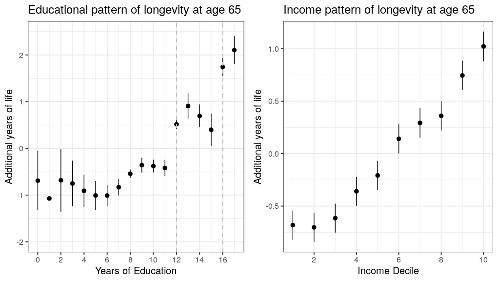

## Summary 

In this vignette, we explore the association between early life characteristics and longevity for the 1910 cohort of males using the CenSoc-DMF data. Ordinary Least Squares (OLS) Regression on age of death is an easy and effective way to analyze the CenSoc mortality data.

This vignette is written in the style of the "tidyverse." There are many other ways to analyze data in R, including base R and `data.table`.

## Getting Started 

Before starting on the tutorial, please follow the instructions in this vignette to extract the 1940 census from IPUMS and match it onto your CenSoc file. Make sure to add the following variables to your cart while making your IPUMS extract: 

- `HISTID` 
- `EDUCD`
- `RACE`
- `OWNERSHP`
- `INCWAGE`

```{r, eval = F}
## Library Packages
library(data.table)
library(ipumsr)
library(tidyverse)
library(gridExtra)
library(ggpubr)
library(broom)

censoc <- fread("/censoc/data/censoc_linked_with_census/1940/censoc_dmf_all_vars_v1.csv")

## Restrict to cohort of 1910
censoc <- censoc %>% 
  filter(byear == 1910) 

## Restrict to men with a non-missing value of income and education
censoc <- censoc %>% 
  filter(INCWAGE > 0 & INCWAGE < 5500) %>% ## Income is topcoded at 5500
  filter((EDUC > 0 & EDUC < 999)) ## Education is topcoded at 999
```

## Data Preparation

IPUMS variables often have value labels, which are text that corresponds to numeric codes (e.g., the `SEX` variable has value labels: 1 = "Male", 2 = "Female").

The `IPUMSR` package includes helpful functions for assigning values labels (see the [ipumsr website](http://tech.popdata.org/ipumsr/index.html) for more information and tutorials). In this vignette, for simplicity, we will manually code our value labels. 

```{r, eval = F}
## recode educ_yrs var to years of education
censoc <- censoc %>%
  mutate(educ_yrs = case_when(
  EDUC == 2 ~ 0,
  EDUC == 14 ~ 1,
  EDUC == 15 ~ 2,
  EDUC == 16 ~ 3,
  EDUC == 17 ~ 4,
  EDUC == 22 ~ 5,
  EDUC == 23 ~ 6,
  EDUC == 25 ~ 7,
  EDUC == 26 ~ 8,
  EDUC == 30 ~ 9,
  EDUC == 40 ~ 10,
  EDUC == 50 ~ 11,
  EDUC == 60 ~ 12,
  EDUC == 70 ~ 13,
  EDUC == 80 ~ 14,
  EDUC == 90 ~ 15,
  EDUC == 100 ~ 16,
  EDUC == 110 ~ 17
))

## Recode RACE var to string
censoc <- censoc %>% 
  mutate(race_string = case_when(
    RACE == 100 & HISPAN == 0 ~ "White",
    RACE == 200 & HISPAN == 0 ~ "Black", 
    TRUE ~ "Other"
  ))

## Recode OWNERSHP var to string
censoc <- censoc %>% 
  mutate(ownership_string = case_when(
    OWNERSHP == 10 ~ "Owner",
    OWNERSHP == 20 ~ "Renter"))
```


## Quick Exploratory Data Analysis 

Exploratory data analysis is an important part of the modeling process. Exploratory data analysis can help us understand the main characteristics of the data and their relationship with our dependent variable, age at death. Here, we will briefly explore some associations between our independent and dependent variables.

```{r, eval = F}
## additional years of life expectancy 
educ_df <- censoc %>% 
  group_by(educ_yrs) %>% 
  summarize(death_age_educ = mean(death_age), sd = sd(death_age) * (1/sqrt(n())) ) %>% 
  mutate(add_yrs_life = death_age_educ - mean(death_age_educ)) %>% 
  ungroup()

## Education Plot
educ_plot <- ggplot(data = educ_df, mapping = aes(x = educ_yrs, y = add_yrs_life)) +
  geom_pointrange(aes(ymin = add_yrs_life - 1.96*sd, ymax = add_yrs_life + 1.96*sd)) +
  theme_minimal() + 
  scale_x_continuous(breaks=seq(0,17,2)) +
  geom_vline(xintercept = c(8, 12, 16), lwd = .7, lty = 2, color = "grey") + 
  labs(title = "Educational pattern of longevity at age 65",
       x = "Years of Education",
       y = "Additional years of life") 

## Income Deciles
income_df <- censoc %>% 
  filter(INCWAGE < 5500 & INCWAGE > 0) %>% 
  filter(!is.na(INCWAGE)) %>% 
  mutate(wage_decile = ntile(INCWAGE,10)) %>% 
  group_by(wage_decile) %>% 
  summarize(death_age_decile = mean(death_age), sd = sd(death_age) * (1/sqrt(n())) ) %>% 
  mutate(add_yrs_life = death_age_decile - mean(death_age_decile))

## Income Plot
income_plot <- ggplot(data = income_df, mapping = aes(x = wage_decile, y = add_yrs_life)) +
  theme_minimal() + 
  geom_pointrange(aes(ymin = add_yrs_life - 1.96*sd, ymax = add_yrs_life + 1.96*sd)) +
  labs(title = "Income pattern of longevity at age 65",
       x = "Income Decile",
       y = "Additional years of life")+ 
  ylim(-2, 2)

## Display Plots
ggarrange(educ_plot, income_plot)
```
{width=100%}

## OLS Regression

There are two specific considerations for using regression on age of death to analyze the CenSoc Mortality data. First, we are only observing deaths for a narrow window. As the left and right truncation ages vary by birth cohort, it is important to include fixed effect terms for each year of birth. Models of the form:

$$ Age\_at\_death = birth\_year\_dummy + covariates\_of\_interest $$

provide estimates of the effect of the covariates on the age of death in the sample, controlling for birth cohort truncation effects.

In this case, we are only looking at the cohort of 1910, so we do not need to include a fixed effect term for year of birth. 

```{r, eval = F}
## Prepare for Regression
censoc <- censoc %>% 
  mutate(race_string = as.factor(race_string)) %>% 
  mutate(race_string = relevel(race_string, ref = "White"))  

## Plot Model
model <- lm(death_age ~ INCWAGE + educ_yrs + ownership_string + race_string,
            data = censoc,
            weights = weight)

summary(model)

#> Call:
#> lm(formula = death_age ~ INCWAGE + educ_yrs + ownership_string + 
#>     race_string, data = censoc)
#> 
#> Residuals:
#>      Min       1Q   Median       3Q      Max 
#> -16.7031  -6.5771  -0.1929   6.3567  19.2876 
#> 
#> Coefficients:
#>                          Estimate Std. Error t value Pr(>|t|)    
#> (Intercept)             7.580e+01  1.354e-01 559.923  < 2e-16 ***
#> INCWAGE                 3.988e-04  3.534e-05  11.283  < 2e-16 ***
#> educ_yrs                1.879e-01  8.177e-03  22.984  < 2e-16 ***
#> ownership_stringRenter -3.545e-01  4.856e-02  -7.301 2.86e-13 ***
#> race_stringWhite        1.746e-01  1.240e-01   1.408    0.159    
#> race_stringOther        1.521e+00  2.109e-01   7.213 5.52e-13 ***
#> ---
#> Signif. codes:  0 ‘***’ 0.001 ‘**’ 0.01 ‘*’ 0.05 ‘.’ 0.1 ‘ ’ 1
#> 
#> Residual standard error: 7.99 on 123876 degrees of freedom
#>   (3013 observations deleted due to missingness)
#> Multiple R-squared:  0.00963,	Adjusted R-squared:  0.00959 
#> F-statistic: 240.9 on 5 and 123876 DF,  p-value: < 2.2e-16
```


## Visualizing Model Coefficients

The `broom` package takes the results from the model we ran in R and conveniently formats it as a data.frame representation. Using this package, we both extract and plot our coefficients and associated confidence intervals. 

For a more comprehensive review of working with model-based graphics in `R`, we recommend Kieran Healy's [Data Visualization: A Practical Introduction](https://socviz.co/). 

```{r, eval = F}
## construct a data.frame of the results of our statistical model
tidy.model <- tidy(model, conf.int = T)
tidy.model <- subset(tidy.model, !term %in% "(Intercept)")

## Plot Regression Coefficients
ggplot(tidy.model, mapping = aes(x = term, y = estimate, ymax = conf.high, ymin = conf.low)) +
  geom_pointrange() + 
  coord_flip() + 
  theme_bw(base_size = 15) + 
  labs(y = "OLS Estimate")
```

{width=100%}

## Interpretation of Regression Coefficients

The right truncation will tend to downwardly bias the estimated effects of any covariates. Right truncation excludes the right tail of the distribution, thus reducing the average difference between groups. The effect of these coefficients would be even larger, and the appropriate regression coefficient adjustment factors can be found through simulating a Gompertz mortality schedule. For more information on regression coefficient adjustment factors, see our [BUNMD Working Paper](https://censoc.berkeley.edu/wp-content/uploads/2020/04/bunmd_working_paper.pdf). 


