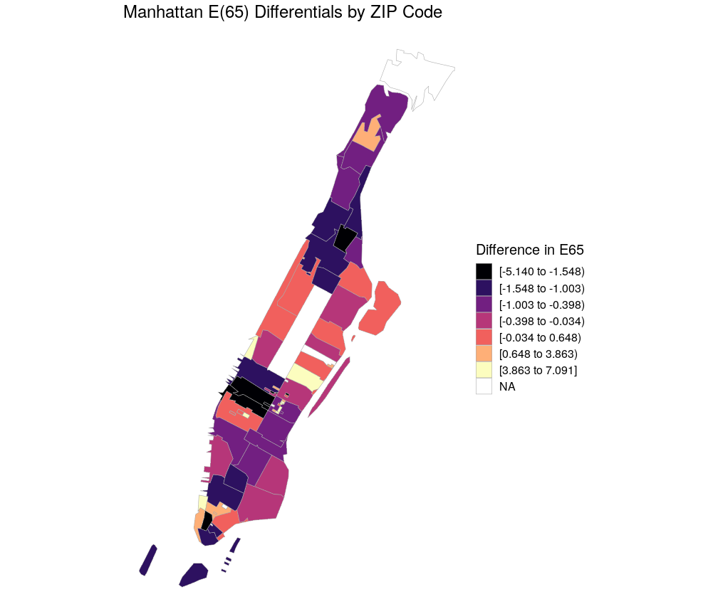

This tutorial will walk through the steps of visualizing differentials in e(65) — life expectancy conditional on surviving to age 65 — by ZIP Code using the Berkeley Unified Numident Mortality Database 

Specifically, this vignette will walk through the steps of (1) calculating differentials by ZIP Code and (2) creating a choropleth map in R using the `choroplethr` package. Choropleths are thematic maps where each geographic region is colored or shaded according to some metric.

Though this analysis focuses on the New York City borough of Manhattan, the approach can be replicated for other regions to similar effect. 

### Geography in BUNMD

There are several geographic variables in the Berkeley Unified Numident Mortality Database (BUNMD).

- `bpl` variable reports birthplace. For persons born in the United States, the geographic resolution is state-level, and for persons born outside the United States, the geographic resolution is country-level. 

- `zip_residence` variable reports the 9-digit ZIP Code of residence at the time of death for a portion of records. ZIP Codes, while not the most robust geographic unit of analysis, can offer insights into a variety of spatial questions.


```{r, eval = F}
## library packages
library(tidyverse)
library(choroplethrZip)
library(choroplethr)
library(broom)
library(viridis)

## Read in data
bunmd <- fread("/censoc/data/numident/4_berkeley_unified_mortality_database/bunmd.csv")
```

### Preparing Data for Analysis 

We will look at the subsample of the BUNMD with high death coverage — deaths occurring between 1988-2005. For our analysis, we will focus on 5-digit ZIP Codes, rather than the full 9-digit ZIP Codes. 

```{r, eval = F}
## Read ZIP Codes
data("zip.regions")
 
## Filter to  ZIP Codes in manhattan
county <- c("new york")

manhattan.zipcodes <- zip.regions %>% 	
  filter(state.name == "new york") %>% 
  filter(county.name %in% county)

## Select first 5 digits of zip_residence variable
## filter to only include high coverage Manhattan ZIP Codes
bunmd.manhattan <- bunmd %>% 
  mutate(zip5 = as.numeric(substr(zip_residence, 1, 5))) %>% 
  filter(zip5 %in% manhattan.zipcodes$region) %>% 
  filter(byear %in% c(1910:1919)) %>% 
  filter(dyear %in% 1988:2005)

## prepare for regression
bunmd.manhattan <- bunmd.manhattan %>% 
  mutate(byear = as.factor(byear)) %>% 
  mutate(byear = relevel(byear, ref = "1910")) %>% 
  mutate(zip5 = as.factor(zip5)) %>% 
  mutate(zip5 = relevel(zip5, ref = "10463"))
```

### Ordinary Least Squares Regression

Regression on age at death is an easy and effective way to analyze the BUNMD mortality
data. Regression coefficients tell the effect of covariates on the mean age at death. Because we are only observing a narrow window of deaths, the left and right truncation ages vary by cohort. It is important to include fixed effect terms for each year of birth.

Because each birth cohort has a different age of left and right truncation, it is important to include fixed effect terms for each year of birth. Models of the form:

$$ Age\_at\_death = birth\_year\_dummy + covariates\_of\_interest$$ 

provide estimates of the effect of the covariates on the age of death in the sample, controlling
for birth cohort truncation effects.

The code below first fits a linear regression using fixed-effect terms for each year of birth. It then extracts the regression coefficients for each ZIP code.

Note: When running the regression, we weight each observation using the `ccweight` variable — a post-stratification weight to Human Mortality Database death totals by age, period, and sex.

```{r, eval = F}
## Linear model predicting age at death from ZIP and byear 
manhattan.lm <- lm(death_age ~ zip5 +  byear,
                     data = bunmd.manhattan,
                     weight = ccweight) 

## Put model results into a data.frame 
manhattan.lm.df <- tidy(manhattan.lm)

## Select coefficients and ZIP Codes
manhattan.lm.df <- manhattan.lm.df %>%
  select(term, estimate) %>% 
  filter(str_detect(term, "zip")) %>% 
  mutate(zip = substr(term, 5, 9)) %>% 
  select(region = zip, value = estimate)
```

### Choropleth Map 

The `choroplethr` package provides helpful functions to simplify the construction of choropleth maps. The code below constructs a choropleth map where each ZIP code in Manhattan is colored according to its coefficient differentials. 

```{r, eval = F}
## Plot Manhattan

manhattan.fip = 36061
choro = ZipChoropleth$new(rev(manhattan.lm.df))
choro$title = "Manhattan E(65) Differentials by ZIP Code"
choro$set_zoom_zip(state_zoom = NULL, county_zoom = manhattan.fip, msa_zoom = NULL, zip_zoom = NULL)
manhattan.plot <- choro$render() +
    theme(text=element_text(size=15)) + 
  scale_fill_viridis(option="magma", discrete = "true", name="Difference in E65")
```

{width=100%}

### Interpretation

When interpreting these mortality differentials, it is important to remember that we are only observing deaths for a truncated window. This truncation will tend to downwardly bias the estimated effects of any covariates, as it excludes the tails of the distribution, thus reducing the average difference between groups. The average differences between groups will be measured to be smaller if we exclude the tails of the distribution.

Appropriate regression coefficient adjustments can be found through simulation. Please see [BUNMD working paper](https://censoc.berkeley.edu/wp-content/uploads/2020/04/bunmd_paper.pdf) for more information. 
